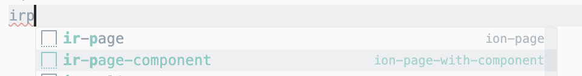

1.npm install

## ionic cli 설치

2.npm install -g @ionic/cli

## 브라우저에 프로젝트 띄우기

3.ionic serve

## 확장툴

ionic Snippets

## notice

1. ionic component 사용하실 때 컬러는 따로 넣지 마시고-----> https://ionicframework.com/docs/api/button#theming 주어진 키값을 사용하세요.
2. html tag 사용하시면 theme 폴더에 있는 variables.css 파일 :root 안에 들어있는 키값들을 사용하면 됩니다. ( 나중에 테마컬러 바꿀 때 이 파일 만 바꿔주면 되기 때문)
3. icon은 https://ionic.io/ionicons 이걸 사용해주세요.
